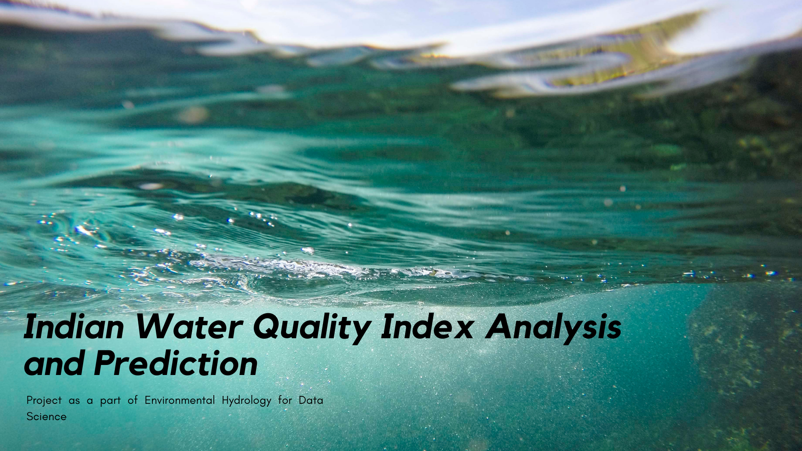

# Indian water quality analysis and prediction

With fast economic growth and increased urbanization, water pollution has become grimmer. Understanding the issues and patterns of water quality is also critical for water
pollution reduction and regulation .

<p align="center">
 
</p>

## Overview

<details open="open">
  <summary>Contents</summary>
  <ul>
    <li>
      <a href="#problem-statement">Problem Statement</a>
    </li>
    <li>
      <a href="#objective">Objective</a>
    </li>
    <li>
      <a href="#dataset">Dataset</a>
    </li>
    <li>
      <a href="#process-flow">Process Flow</a>
    </li>
    <li>
       <a href="#calculations">Calculations</a>
     </li>
    <li>
      <a href="#data-visualization">Data Visualization</a>
    </li>
    <li>
      <a href="#model-used">Model Used</a>
    </li>
    <li>
      <a href="#predicted-output">Predicted Output</a>
    </li>
    <li>
      <a href="#library">Libraries</a>
    </li>
     <li>
      <a href="#usage">How to use</a>
    </li>
    <li>
      <a href="#references">References</a>
    </li>
  </ul>
</details>

## problem-statement
🤔
>Safe and readily available water is important for public health, whether it is used for drinking, domestic use, food production or recreational purposes.
>
> Water quality prediction is important for water quality preparation and regulation.
> 
> Strategies for the prevention and regulation of water contamination can be developed by predicting future changes in water safety at varying levels of contamination
and devising rational strategies to prevent and regulate water contamination.

Designated Best Use	Class of Water	Criteria - 
> According to Central Pollution Control Board,Inland  surface water is categorised in 4 different categories, on the basis of use as shown in the table below - 
<table>
 <th> Designated Best Use </th>
 <th> Class of Water </th>
 <th> Criteria </th>
 <tr> 
   <td>
  Drinking water Source without Conventional treatment but after disinfections.
   </td>
  <td>
 A
   </td>
  <td>
1.    Total coliform organisms MPN/100 ml shall be 50(max.) <br>
2.   pH between 6.5 to 8.5 <br>
3.    Dissolved Oxygen (Min) 6 mg/l <br>
4.    BOD (max) 5 days < 2.00 mg/l <br>
   </td>
 </tr>
 
  <tr> 
   <td>
Outdoor bathing(Organised)
   </td>
  <td>
 B
   </td>
  <td>
1.    Total coliform organisms MPN/100 ml shall be 500 (max.)<br>
2.    Fecal Coliform MPN/100 mg. to be 2500 (max.) for Ganga Action Plan.<br>
3.   pH between 6.8 to 8.5.<br>
4.    Dissolved Oxygen (min) 4 mg/l <br>
5.    BOD (Max.) 5 days @ 3 mg/l <br>
   </td>
 </tr>
 
 <tr> 
   <td>
Drinking water with conventional treatment Followed by disinfections
   </td>
  <td>
 C
   </td>
  <td>
1.    Total coliform organisms MPN/100 ml shall be 5000 (max.) <br>
2.    PH between 6.8 to 8.5 <br>
3.    Dissolved Oxygen (min) 4 mg/l <br>
4.    BOD (max.) 5 days @ 3 mg/l <br>
   </td>
 </tr>
 
 <tr> 
   <td>
Propagation of wild life Fisheries.
   </td>
  <td>
 D
   </td>
  <td>
1.    pH between 6.5 to 8.5 <br>
2.    Dissolved Oxygen (min) 4 mg/l. <br>
3.    Free Ammonia (as N) (max)1.2mg/l. <br>
   </td>
 </tr>
 
</table>


## objective
🎯

> The system will help reduce people’s consumption of poor-quality water and consequently curtail horrific diseases such as typhoid and diarrhea. 
> 
> To understand what constitutes safe, potable water and distinguish between potable and non-potable water by applying machine learning techniques.
> 
> In this case, our application can improve water pollution in different water bodies.
> 
>  The robustness and efficiency of the proposed model in predicting WQI can be examined in futureworks.


## dataset
📊

>The [dataset](https://www.kaggle.com/anbarivan/indian-water-quality-analysis-and-prediction/data) contains water quality metrics for 3276 different water bodies.
>
> * STATION CODE
> * LOCATION
> * STATE 
> * TEMPERATURE	
> * D.O. (mg/l)	
> * PH	
> * CONDUCTIVITY (mhos/cm)	
> * B.O.D. (mg/l)	
> * NITRATENAN N+ NITRITENANN (mg/l)	
> * FECAL COLIFORM (MPN/100ml)
> * TOTAL COLIFORM (MPN/100ml)
> * YEAR
> <p align="center">
  
  </p>
  
#### Importing Dataset
```
df=pd.read_csv('water_potability.csv')
```
If your notebook and csv files are in different places you can write the whole path to import the file.
```
df=pd.read_csv('../input/water-potability/water_potability.csv')
```

#### Exploratory Data Analysis
Step 1)
```
data.info()
```


Step 2) converting all non-numerical values to NaN
```
data['Temp']=pd.to_numeric(data['Temp'],errors='coerce')
data['D.O. (mg/l)']=pd.to_numeric(data['D.O. (mg/l)'],errors='coerce')
data['PH']=pd.to_numeric(data['PH'],errors='coerce')
data['B.O.D. (mg/l)']=pd.to_numeric(data['B.O.D. (mg/l)'],errors='coerce')
data['NITRATENAN N+ NITRITENANN (mg/l)']=pd.to_numeric(data['NITRATENAN N+ NITRITENANN (mg/l)'],errors='coerce')
data['TOTAL COLIFORM (MPN/100ml)Mean']=pd.to_numeric(data['TOTAL COLIFORM (MPN/100ml)Mean'],errors='coerce')
data.dtypes
```
Step 3) Checking for NaN Values and removing them
```
data.isna()
data = data.dropna()
```
Step 4) Making the data more presentable and formatting columns
```
data=pd.concat([station,location,state,do,ph,co,bod,na,tc,year],axis=1)
data. columns = ['station','location','state','do','ph','co','bod','na','tc','year']
```
Step 5) Used MS Excel to do intensive formating in various columns. <br> (Example - There were multiple spelling of same states such as Orissa, Odhisha and Orisha.)


## process-flow
🎞️
> The dataset will be analyzed in the following manner.

 


  
## calculations

> The **WQI**, which is calculated using several parameters that affect WQ , was used
> to measure water quality.
> 
> 
> 
> 
> where N denotes the total number of parameters included in the `WQI` formula, qi denotes
> the quality estimate scale for each parameter i calculated by Formula (2), and wi denotes
> the unit weight of each parameter in Formula (3)
> 
> 
> 
> where Vi is a measured value that refers to the water samples tested, VIdeal is an ideal value
> and indicates pure water (0 for all parameters except OD = 14.6 mg/L and pH = 7.0), and
> Si is a standard value recommended for parameter i, taken from internet.
> 
> 
> 
> where K denotes the constant of proportionality, which is calculated using the following
> formula:
> 
> 
> 

## data-visualization
👀
> The data has been analyzed using Tableau

## model-used
🤖

After EDA and extensive Data Cleaning, we have implemented ARIMA (Autoregrssive Integrated Moving Average) Time Series forcasting for Water Quality Index.
It's used in statistics and econometrics to measure events that happen over a period of time. The model is used to understand past data or predict future data in a series.
Model Performance - <br>


<br>
However, after this to improve upn the model, we implemented Rolling forecast ARIMA (Autoregrssive Integrated Moving Average) model. Further Evaluation was done using walk forward validation and then the forcasts were evaluated.


  
## predicted-output
💯 

> The model's accuracy is being evaluated using K-fold cross-validation.
> 
> The evaluation metrics include RMSE(Root Mean Square Error) and R2 score.
> 
> Ml model can be developed to predict `WQI` by selecting important parameters from a standard dataset precited using machine learning model .

## library
📚
> [`numpy`](https://numpy.org/doc/stable/)  adds support for large, multi-dimensional arrays and matrices, along with a large collection of high-level mathematical functions to operate on these arrays.
> 
> [`matplotlib`](https://matplotlib.org/stable/) is a plotting library for the Python programming language and its numerical mathematics extension NumPy. It provides an object-oriented API for embedding plots into applications using general-purpose GUI toolkits.
> 
> [`scipy`](https://scipy.github.io/devdocs/index.html) is used for scientific computing and technical computing. It contains modules for optimization, linear algebra, integration, interpolation, special functions, FFT, signal and image processing, ODE solvers and other tasks.
> 
> [`pandas`](https://pandas.pydata.org/pandas-docs/stable/reference/api/pandas.DataFrame.html) is for data manipulation and analysis. In particular, it offers data structures and operations for manipulating numerical tables and time series.
> 
> [`sklearn`](https://scikit-learn.org/stable/) or scikit-learn features various classification, regression and clustering algorithms and is designed to interoperate with the Python numerical and scientific libraries NumPy and SciPy.

## usage
👓
> Can be used to predict WQI by selecting important parameters from a standard dataset precited using machine learning model .
> 
> The robustness and efficiency of the proposed model in predicting WQI can be examined in futureworks.


## References
🔖

> https://ieeexplore.ieee.org/document/7944943/metrics#metrics
>
> https://www.mdpi.com/2071-1050/13/8/4259/pdf


<!-- https://www.utc.fr/~jlaforet/Suppl/python-cheatsheets.pdf -->
